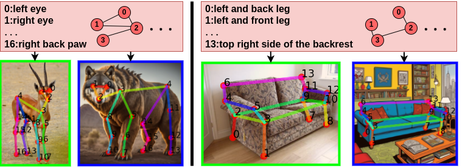

# CapeX: Category-Agnostic Pose Estimation from Textual Point Explanation [ICLR 2025]

[](https://paperswithcode.com/sota/2d-pose-estimation-on-mp-100?p=capex-category-agnostic-pose-estimation-from)
<a href="https://arxiv.org/pdf/2406.00384"></a>
[](https://huggingface.co/spaces/matanru/CapeX)
<a href="https://www.apache.org/licenses/LICENSE-2.0.txt"></a>


By [Matan Rusanovsky](https://scholar.google.com/citations?view_op=list_works&hl=en&user=5TS4vucAAAAJ), [Or Hirschorn](https://scholar.google.co.il/citations?user=GgFuT_QAAAAJ&hl=iw&oi=ao) and [Shai Avidan](https://scholar.google.co.il/citations?hl=iw&user=hpItE1QAAAAJ)

This is the official implementation of "[CapeX: Category-Agnostic Pose Estimation from Textual Point Explanation](https://arxiv.org/pdf/2406.00384)".

<p align="center">

</p>

## Introduction

Recent CAPE works have produced object poses based on arbitrary keypoint definitions annotated on a user-provided support image. Our work departs from conventional CAPE methods, which require a support image, by adopting a text-based approach instead of the support image. 
Specifically, we use a pose-graph, where nodes represent keypoints that are described with text. This representation takes advantage of the abstraction of text descriptions and the structure imposed by the graph.
Our approach effectively breaks symmetry, preserves structure, and improves occlusion handling.

## Citation
If you find this useful, please cite this work as follows:
```bibtex
@inproceedings{
rusanovsky2025capex,
title={CapeX: Category-Agnostic Pose Estimation from Textual Point Explanation},
author={Matan Rusanovsky and Or Hirschorn and Shai Avidan},
booktitle={The Thirteenth International Conference on Learning Representations},
year={2025},
url={https://openreview.net/forum?id=scKAXgonmq}
}
```

## Getting Started

### Conda Environment Set-up 
Please run:
```
conda env create -f environment.yml
conda activate capex
```

### Docker

We provide a docker image for easy use.

You can simply pull the docker image from docker hub, containing all the required libraries and packages:

```
docker pull matanru/capex

docker run --name capex -v {DATA_DIR}:/workspace/CapeX/CapeX/data/mp100 -it matanru/capex /bin/bash
```


## Demo on Custom Images

### HuggingFace Demo
Please note that the demo demonstrates **CapeX-S**, i.e. our approach with SwinV2-S image backbone (and not SwinV2-T).

[](https://huggingface.co/spaces/matanru/CapeX)


### Gradio Demo
Download the [pretrained model](https://drive.google.com/file/d/1AkeGHh5p4HWZowIb4JpzY8i7qk6BoOkK/view?usp=drive_link) and run:
```
python app.py --checkpoint [path_to_pretrained_ckpt]
```
### Terminal Demo
Download
the [pretrained model](https://drive.google.com/file/d/1AkeGHh5p4HWZowIb4JpzY8i7qk6BoOkK/view?usp=drive_link)
and run:
```
python demo_text.py --support_points [<text description of point 1>, <text description of point 2>, ...] --support_skeleton [[1st point index of edge 1, 2nd point index of edge 1], ...] --query [path_to_query_image] --config configs/1shot-swin-gte/graph_split1_config.py --checkpoint [path_to_pretrained_ckpt]
```
For example:
```
python demo_text.py --support_points "['left and front leg', 'right and front leg', 'right and back leg', 'left and back leg', 'left and front side of the seat', 'right and front side of the seat', 'right and back side of the seat', 'left and back side of the seat', 'top left side of the backseat', 'top right side of the backseat']" --support_skeleton "[[0, 4], [3, 7], [1, 5], [2, 6], [4, 5], [5, 6], [6, 7], [7, 4], [6, 7], [7, 8], [8, 9], [9, 6]]" --query examples/chair.png --config configs/1shot-swin-gte/graph_split1_config.py --checkpoint [path_to_pretrained_ckpt] 
```


## MP-100 Dataset
Please follow the [official guide](https://github.com/luminxu/Pose-for-Everything/blob/main/mp100/README.md) to prepare the MP-100 dataset for training and evaluation, and organize the data structure properly.

Then, use [Pose Anything's](https://github.com/orhir/PoseAnything) updated annotation file, with all the skeleton definitions, from the following [link](https://drive.google.com/drive/folders/1uRyGB-P5Tc_6TmAZ6RnOi0SWjGq9b28T?usp=sharing).

**Please note:**

Current version of the MP-100 dataset includes some discrepancies and filenames errors:
1. Note that the mentioned DeepFasion dataset is actually DeepFashion2 dataset. The link in the official repo is wrong. Use this [repo](https://github.com/switchablenorms/DeepFashion2/tree/master) instead.
2. Use [Pose Anything's](https://github.com/orhir/PoseAnything) script to fix CarFusion filename errors, which can be run by:
```
python tools/fix_carfusion.py [path_to_CarFusion_dataset] [path_to_mp100_annotation]
```

Our text descriptions are added to the keypoints, based on [models/datasets/datasets/mp100/utils.py](models/datasets/datasets/mp100/utils.py) .

## Training

### Backbone
To use pre-trained Swin-Transformer as used in our paper, we provide the weights, taken from this [repo](https://github.com/microsoft/Swin-Transformer/blob/main/MODELHUB.md), in the following [link](https://drive.google.com/drive/folders/1-q4mSxlNAUwDlevc3Hm5Ij0l_2OGkrcg?usp=sharing).
These should be placed in the `./pretrained` folder.

### Training
To train the model, run:
```
python train.py --config [path_to_config_file]  --work-dir [path_to_work_dir]
```

## Evaluation and Pretrained Models
Here we provide the evaluation results of our pretrained models on MP-100 dataset along with the config files and checkpoints:

| Setting |                                                                    split 1                                                                     |                                                                    split 2                                                                     |                                                                    split 3                                                                     |                                                                    split 4                                                                     |                                                                    split 5                                                                     | Average |
|:-------:|:----------------------------------------------------------------------------------------------------------------------------------------------:|:----------------------------------------------------------------------------------------------------------------------------------------------:|:----------------------------------------------------------------------------------------------------------------------------------------------:|:----------------------------------------------------------------------------------------------------------------------------------------------:|:----------------------------------------------------------------------------------------------------------------------------------------------:|:-------:|
|  CapeX  |                                                                     92.79                                                                      |                                                                     89.47                                                                      |                                                                     84.95                                                                      |                                                                     87.25                                                                      |                                                                     89.61                                                                      |  88.81  |
|         |    [link](https://drive.google.com/file/d/1AkeGHh5p4HWZowIb4JpzY8i7qk6BoOkK/view?usp=drive_link) / [config](configs/tiny/tiny_split1_config.py)    | [link](https://drive.google.com/file/d/1sFmoBlv4Vcf1YkjPTHnTu08GXjWeb_IB/view?usp=drive_link) / [config](configs/tiny/tiny_split2_config.py) |    [link](https://drive.google.com/file/d/1OvV4rErOkUnW6QP9k3B8g2RLOfmjX8GD/view?usp=drive_link) / [config](configs/tiny/tiny_split3_config.py)    |    [link](https://drive.google.com/file/d/1_aaJRbhNa69EMyPMtU2g8Mmkj76hLGic/view?usp=drive_link) / [config](configs/tiny/tiny_split4_config.py)    |    [link](https://drive.google.com/file/d/1m7GICU5O0duHXOQtkEsMwcHt5MbZe1z7/view?usp=drive_link) / [config](configs/tiny/tiny_split5_config.py)    |
| CapeX-S |                                                                     95.62                                                                      |                                                                     90.94                                                                      |                                                                     88.95                                                                      |                                                                     89.43                                                                      |                                                                     92.57                                                                      |  91.50  |
|         | [link](https://drive.google.com/file/d/1hmvxTjP84YywVhhckMt1NHc3wUTqQIqp/view?usp=drive_link) / [config](configs/small/small_split1_config.py) | [link](https://drive.google.com/file/d/1sxmG0O1w2qXC3fmhIUuH9FpOR-PWKYHT/view?usp=drive_link) / [config](configs/small/small_split2_config.py) | [link](https://drive.google.com/file/d/1whMVfzCNHD9PLJY5-7Hzh9CXtdMGPDYG/view?usp=drive_link) / [config](configs/small/small_split3_config.py) | [link](https://drive.google.com/file/d/1znrw_pgCKuy4sQ7RzQf6LyXW5poV5G3-/view?usp=drive_link) / [config](configs/small/small_split4_config.py) | [link](https://drive.google.com/file/d/1_62mpIsZ_o1NGKng-KlNQBPZAnSuD7Zb/view?usp=drive_link) / [config](configs/small/small_split5_config.py) |


### Evaluation
To evaluate the pretrained model, run:
```
python test.py [path_to_config_file] [path_to_pretrained_ckpt]
```
## Acknowledgement

Our code is based on code from:
 - [Pose Anything](https://github.com/orhir/PoseAnything)
 - [MMPose](https://github.com/open-mmlab/mmpose)
 - [CapeFormer](https://github.com/flyinglynx/CapeFormer)


## License
This project is released under the Apache 2.0 license.
